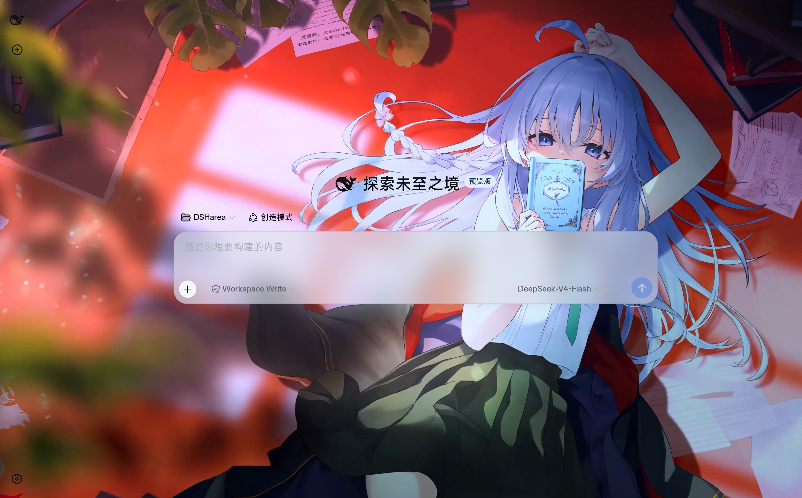
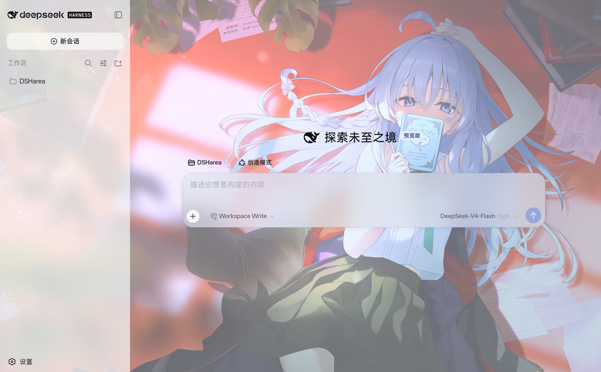
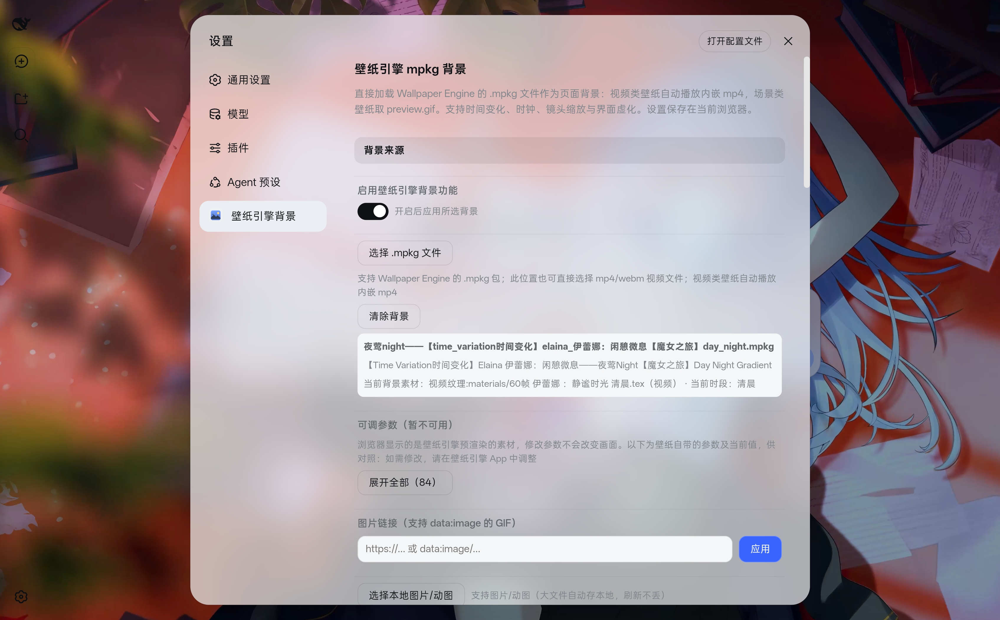

# dsh-mpkg-wallpaper — Wallpaper Engine mpkg Background Plugin

[中文](README.md) | [English](README.en.md)

A plugin for the [DeepSeek Harness](https://github.com/deepseek-ai/deepseek-harness) Web UI (dsh web) that turns your background into a **feature-rich wallpaper system** — from parsing Wallpaper Engine `.mpkg` files, to a full-screen frosted blur suite, to a local wallpaper library with automatic rotation. Nearly every visual detail is adjustable.

## Core Features

**📦 Wallpaper Engine `.mpkg` parsing (in the browser)**
- Pick a `.mpkg` file → the container is parsed in-browser (pure client, nothing uploaded to third parties)
- Video wallpapers play their embedded mp4 / video textures automatically; scene wallpapers use the author's `preview.gif` animated preview
- **Time-of-day switching**: packages with multiple variants (`preview_night.gif` / `preview_day.gif` / …) pick the asset matching the current system time
- **Adjustable options (read-only)**: parses `project.json → general.properties` and shows the wallpaper's parameters for reference in the Wallpaper Engine app

**🌊 Full-screen frosted blur suite**
- **Unified blur**: one slider controls the whole screen's haze (0 = fully transparent showing the wallpaper); the chat area and "New chat" button can follow independently
- **Dialog / popover / mask blur**: three independent toggles + amount sliders (center-screen windows / popup menus / backdrop mask)
- Wallpaper frosted-blur slider, panel opacity, independent title-bar frost amount

**🎬 Lens & appearance**
- Lens zoom (10–2000%) & pan, sidebar/title-bar wallpaper visibility toggles, light sharpen, Deep diving background box

**🚀 Hybrid large-file mode**
- On: mpkg is **streamed to the DSH host** → stored on disk → HTTP Range streaming playback, **supports files >600MB** with minimal memory
- Off: pure browser mode (600MB cap)

**🖼️ Local wallpaper library (Windows + cross-platform)**
- **Steam discovery**: auto-locates the Wallpaper Engine install (including non-default drives via registry + libraryfolders.vdf) and lists video/web wallpapers
- **Custom local wallpaper folder**: any folder can become a wallpaper library, with a built-in **cross-platform folder picker** (browse directories step by step)
- **Wallpaper switching & rotation**: one-click "Next wallpaper", or timed auto-rotation (adjustable interval)

**🛡️ Security & coexistence**
- **Conflict detection**: auto-disables itself when other wallpaper/theme plugins are detected
- **Coexists with third-party UI plugins** (DSH-better-sidebar, dsh-chat-import, dsh-sidebar-qa, …): CSS only targets DSH's native area classes, never overriding injected content
- **Security boundary**: .exe/application wallpapers fully excluded (anti-malware), custom folders read images/videos only, host routes have path-traversal guards
- Pure-client parsing stays inside the browser sandbox — malicious mpkg cannot reach the host file system


## Feature Groups

- **Background source**: master toggle, .mpkg file, image URL, local image/GIF
- **Appearance**: panel opacity, frosted blur, lens zoom, lens position
- **UI blur**: unified blur amount, dialog/popover/mask blur toggles + amounts, Deep diving background box, title-bar frost/show
- **Other**: sidebar shows wallpaper, light sharpen, restore defaults


## Supported Inputs

- **Wallpaper Engine .mpkg** (PKGM0014 video / PKGM0018 scene) — you can also pick an **mp4/webm** video file directly.
- Size limits (mobile-browser friendly):
  - Whole file **> 600 MB** is rejected.
  - Standalone video **> 600 MB**, video texture **> 250 MB**, image/GIF **> 200 MB** cannot be processed — the plugin warns and falls back to the preview image when possible.
  - Browser **storage quota** (IndexedDB) can also be a limit; the plugin reports "storage space insufficient" in that case.
- What you get depends on the wallpaper's content:
  - **Video wallpapers** (embedded mp4): the video plays as the background.
  - **Scene wallpapers** (Live2D etc.): uses the author's `preview.gif` (browsers cannot render WE scenes).
  - **Blue/green-screen layers**: falls back to the preview (the raw chroma-keyed footage would show blue/green).


## Limitations

- **Scene-type wallpapers** (Live2D puppet + shader + particles): the full dynamic scene can only be rendered by the Wallpaper Engine app. The browser uses the author-generated `preview.gif`, which may look soft full-screen (zoom/sharpen helps).
- **Options are read-only**: the browser shows pre-rendered assets, so editing options cannot change the picture; apply them in the Wallpaper Engine app instead.
- **Very large assets**: standalone videos >600 MB, video textures >250 MB, images >200 MB cannot be handled by the browser (the plugin warns and falls back to the preview image when possible).


## Screenshots



*Dynamic wallpaper fills the whole UI. With the sidebar collapsed, the chat box sits centered with a frosted blur; the sidebar is fully transparent so the wallpaper shows through cleanly.*



*The effect after adjusting the **Panel opacity** and **Unified blur** sliders (as shown): opacity of most areas is adjustable, the sidebar is translucent and the wallpaper shows through faintly behind it.*



*The settings page. Beyond this screenshot, nearly every appearance aspect is adjustable: unified full-screen blur (chat area / New-chat button can follow independently), dialog / popover / mask blur, lens zoom & pan, sidebar / title-bar wallpaper visibility, title-bar frost amount, sharpen, and time-of-day switching for wallpapers that ship multiple time variants.*

The wallpapers in the screenshots are works by Bilibili creator -夜莺Night: [author homepage](https://b23.tv/86CyaFw).


## Usage

Settings → **Wallpaper Engine Background**:

| Control | Description |
|---|---|
| Choose .mpkg | Uses preview.gif (or time-matched asset) as the dynamic background; you can also pick an mp4/webm file directly |
| Adjustable options | The wallpaper's own parameters and current values (read-only, for reference in the Wallpaper Engine app) |
| Image URL / local image | Plain images or GIFs |
| Panel opacity | 50–100% |
| Frosted blur | How blurred the wallpaper itself is, 0–40px (0 = sharp) |
| Unified blur | One slider controls the whole screen's haze; the chat area / New-chat button can follow independently |
| Dialog / popover / mask blur | Three independent toggles + amount sliders |
| Lens zoom / position | Zoom (10–2000%) and pan the background; zoom out to see components at the picture edges |
| Sidebar / title-bar wallpaper | Toggles; off = solid opaque color for that area |
| Light sharpen | Improves low-res look; turn off if GIFs stutter |


## Install

### Option 1: dsh plugin add (recommended)

```bash
dsh plugin --profile web add dsh-mpkg-wallpaper
# restart dsh web, then hard-refresh the browser (Ctrl+F5)
```

### Option 2: Manual copy

Drop the plugin folder (or extract the GitHub zip) into `$DSH_HOME/profiles/node_modules/dsh-mpkg-wallpaper/`
and register a line in the profile's `cordis.patch.yml`:

```yaml
- insert:
    - id: dsh-mpkg-wallpaper
      name: dsh-mpkg-wallpaper
```

### Option 3: Git clone

```bash
git clone https://github.com/XHR666/dsh-mpkg-wallpaper.git $DSH_HOME/profiles/node_modules/dsh-mpkg-wallpaper
```

Uninstall: `dsh plugin --profile web remove dsh-mpkg-wallpaper` (or remove the mount line + delete the plugin directory + restart).


## Official Docs

Wallpaper Engine's official help site ([help.wallpaperengine.io](https://help.wallpaperengine.io)) has a mobile section (pairing with Windows, etc.); the mpkg container format is proprietary and undocumented.


## Reporting Bugs

When reporting a bug, please attach:
- The **original .mpkg source file** (required to reproduce the issue),
- Browser console output (F12 → Console), if any,
- Your DSH version and platform (Windows / Linux / mobile).


## Security

- **No outbound requests**: the plugin never uses fetch/XHR/WebSocket; the only network behavior is the browser loading an image URL the user typed manually (same as the official example plugins)
- **No sensitive content**: no paths, keys, tokens or personal info in the source
- **No third-party closed source**: depends only on DSH's bundled react and the official slots/locale interfaces
- Reference projects (all open source): [dsh-bg-image](https://github.com/lyh9712/dsh-bg-image) (MIT, template), [unmpkg](https://github.com/aqnya/unmpkg) (GPL-3.0, mpkg binary format only), [repkg](https://github.com/notscuffed/repkg) (GPL, .tex format research), [astc-encoder](https://github.com/ARM-software/astc-encoder) (Apache-2.0, local decode experiments)
- Data boundary: all parsing happens locally in the browser; localStorage only stores background data URLs and option edits


## File Layout

```
dsh-mpkg-wallpaper/
├── package.json      # dsh.bundle + dsh.client manifests
├── cordis.patch.yml  # plugin install declaration (for dsh plugin add)
├── lib/
│   ├── index.js      # empty host-side entry (pure client plugin)
│   └── client.js     # browser side: mpkg parser + settings page + background DOM + blur system
├── tools/            # mpkg/tex/mdl reverse-engineering tools (for developers)
├── README.md         # this file (English)
└── README.zh-CN.md   # 中文说明
```


## Notes for Distribution

### Portability

- No absolute paths, no local ports, no environment-specific config; only DSH's bundled react and the official slots/locale interfaces
- **Custom nav icon**: replace the `NAV_ICON` constant in `lib/client.js` (default: a hand-drawn "landscape" SVG, no trademark) with your own icon (20×20, SVG data URL or base64 PNG recommended)
- The asset-library web page (`http://127.0.0.1:8090/素材库.html`) is a standalone tool, not shipped with the plugin

### Reverse-Engineering Tools (tools/)

| Tool | Purpose |
|---|---|
| `unmpkg.py` | mpkg container parser/extractor (PKGM0014/0018) |
| `tex2png.py` | TEXV0005 texture decoder (DXT5/R8, etc.) |
| `mdl_explorer.py` | .mdl structure explorer (block tags/meshes/float sections) |
| `xref.py` | wallpaper64.exe string xref + disassembly (capstone) |
| `MDL-格式分析笔记.md` | .mdl format reverse-engineering notes (container/mesh solved, skeleton = JSON, animation WIP) |

### Wallpaper Format Research Summary (for other developers)

- **mpkg**: PKGM0014 (video type: mp4+gif+json) / PKGM0018 (scene type: scene.json+tex+mdl+shader)
- **tex**: TEXV0005; format 5 = DXT family, format 34 = embedded MP4 video texture (the 4K animation of customize wallpapers lives right in there)
- **mdl**: MDLV00xx block container; mesh = 8 floats/vertex; MDLS0003/0004 contain JSON skeleton poses; MDLA = animation

## Scene Rendering Feasibility

- Full scenes (Live2D puppets) can only be rendered by proprietary runtimes: the Wallpaper Engine app's native `libscenejni.so` (40 MB, embedded Chromium + proprietary puppet renderer). The open-source [we-layerd](https://github.com/Aromatic05/we-layerd) (Rust) bundles the official renderer but is **Linux Wayland only** (GNOME / niri / Hyprland / KDE Plasma) — it does not run on Windows or inside Termux proot.
- There is no mature WE scene renderer for browsers ([wallgl](https://github.com/lucaschnabel42/wallgl) is a prototype without puppet support; pixeltris/wallpaper-engine-web is gone) — **regardless of OS, no browser can render Live2D scenes directly**.
- **Cross-platform path**: render externally into a video, then use the plugin's **video background** (MP4/WebM stored in IndexedDB, played in a looping `<video>`):
  - **Windows**: the official Wallpaper Engine (Steam, native full-scene rendering) or the open-source [Lively Wallpaper](https://github.com/rocksdanister/lively) (video/web/app wallpapers; does not parse WE scene format) → screen-record to mp4
  - **Linux desktop**: render with we-layerd → screen-record
  - **Mobile**: screen-record in the Wallpaper Engine app
- The plugin behaves identically on every platform (Windows/Linux/macOS/mobile): preview.gif, embedded video textures and time-of-day switching all work.

